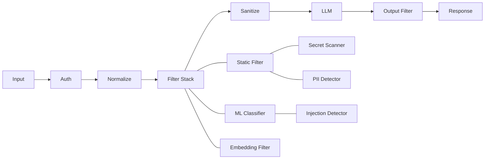

# AiGov 프롬프트 필터링 기능 상세 설계 및 개발 플랜

## 1. 프로젝트 개요

### 1.1. 프로젝트 목표

본 프로젝트의 **주요 목표**는 AI/LLM 서비스의 보안을 강화하기 위한 통합 프롬프트 보안 게이트웨이인 'PromptGate' 모듈을 개발하는 것입니다. 이를 통해 데이터 유출 방지, 규정 준수, 프롬프트 인젝션 차단이라는 **핵심 가치**를 실현하고, AI 서비스의 보안 강화 및 컴플라이언스 자동화라는 **기대 효과**를 달성하고자 합니다.

### 1.2. 프로젝트 범위

*   **포함 범위**: 프롬프트 필터링, 정책 엔진, 모니터링, API 게이트웨이 기능 개발.
*   **제외 범위**: LLM 모델 자체, 프론트엔드 UI, 사용자 관리 시스템.
*   **연동 대상**: 기존 인증 시스템, 로깅 인프라, 모니터링 도구.

### 1.3. 성공 기준

*   **기능적 성공 기준**: 99.9% 이상의 필터링 정확도와 100ms 이하의 응답 시간을 목표로 합니다.
*   **비기능적 성공 기준**: 99.5%의 가용성과 초당 1,000건 이상의 처리 성능을 보장합니다.
*   **보안 성공 기준**: 제로 데이터 유출 및 100% 프롬프트 인젝션 차단을 목표로 합니다.

## 2. 시스템 아키텍처

### 2.1. 전체 구성도

PromptGate는 클라이언트 애플리케이션과 LLM 백엔드(GPT 등) 사이에 위치하여 모든 프롬프트 요청을 중계하고 보안 정책을 적용합니다. 정책 엔진, 벡터 데이터베이스, 감사 로거와 연동하여 지능적인 보안 기능을 수행합니다.

```mermaid
graph LR
    A[Client App] --> B(PromptGate Proxy)
    B --> C[LLM Backend (GPT/etc)]
    B --> D{Policy Engine (OPA)}
    B --> E[Vector DB (Qdrant)]
    B --> F[Audit Logger (OpenSearch)]
```

### 2.2. 프로세싱 파이프라인

PromptGate는 다음의 단계별 프로세싱 파이프라인을 통해 프롬프트 요청을 처리합니다.



## 3. 핵심 컴포넌트 설계

### 3.1. 인증 및 라우팅 레이어

요청 컨텍스트(`RequestContext`)를 생성하고, JWT/API Key 검증, 테넌트/사용자 식별, RBAC(역할 기반 접근 제어) 권한 확인을 수행합니다.

```python
@dataclass
class RequestContext:
    tenant_id: str
    user_id: str
    session_id: str
    request_id: str
    timestamp: datetime
    client_ip: str
    user_agent: str
    
class AuthenticationHandler:
    async def authenticate(self, request: Request) -> RequestContext:
        # JWT/API Key 검증, 테넌트/사용자 식별, RBAC 권한 확인 로직 구현
        pass
```

### 3.2. 정책 엔진 (OPA 기반)

Open Policy Agent(OPA)를 활용하여 Rego 정책 언어 기반의 규칙 엔진을 구현합니다. 테넌트별 규칙 적용, 사용자 권한 체크, 콘텐츠 분류 결과 반영 등 동적인 정책 평가를 수행합니다.

```python
class PolicyEngine:
    def __init__(self):
        self.opa_client = OPAClient()
        self.policies = {}
    
    async def evaluate(self, context: RequestContext, prompt: str) -> PolicyResult:
        # Rego 정책 평가 로직 구현
        pass

# Rego 정책 예시:
# package promptgate
# default allow = false
# allow {
#     input.tenant == "kra-internal"
#     not contains_secrets(input.prompt)
#     not contains_injection(input.prompt)
#     user_has_permission(input.user)
# }
```

### 3.3. 필터 스택 구현

다양한 유형의 보안 위협을 탐지하기 위한 필터들을 스택 형태로 구성합니다.

#### 3.3.1. Static Pattern Filter

정규식 및 Vectorscan 라이브러리를 활용하여 미리 정의된 패턴(예: 욕설, 특정 키워드)을 탐지하고 차단합니다.

```python
class StaticPatternFilter:
    def __init__(self, config: Dict):
        self.deny_patterns = [re.compile(p, re.IGNORECASE) for p in config.get("deny_patterns", [])]
        self.vectorscan = load_vectorscan_db(config.get("pattern_db"))
    
    async def filter(self, prompt: str) -> FilterResult:
        # Regex 패턴 매칭 및 Vectorscan 고성능 패턴 매칭 로직 구현
        pass
```

#### 3.3.2. Secret Scanner

AWS 키, JWT, 비밀번호, 주민등록번호 등 민감한 정보(시크릿)를 탐지합니다. TruffleHog/Gitleaks와 같은 도구를 통합하여 활용할 수 있습니다.

```python
class SecretScanner:
    def __init__(self):
        self.detectors = [
            AWSKeyDetector(), JWTDetector(), PasswordDetector(), KoreanNationalIDDetector()
        ]
    
    async def scan(self, prompt: str) -> List[SecretMatch]:
        # 다양한 시크릿 탐지기 로직 구현
        pass
```

#### 3.3.3. PII Detector (Presidio 연동)

Microsoft Presidio를 연동하여 개인 식별 정보(PII)를 탐지하고 마스킹/익명화합니다. 한국어 특화 PII 패턴(주민번호, 휴대폰 번호 등)을 추가하여 정확도를 높입니다.

```python
class PIIDetector:
    def __init__(self):
        self.analyzer = AnalyzerEngine()
        self.anonymizer = AnonymizerEngine()
        # 한국어 PII 패턴 추가 로직 구현
    
    async def detect(self, text: str) -> List[PIIMatch]:
        # PII 탐지 로직 구현
        pass
    
    async def anonymize(self, text: str, pii_matches: List[PIIMatch]) -> str:
        # PII 마스킹/익명화 로직 구현
        pass
```

#### 3.3.4. ML 기반 분류기

Hugging Face Transformers와 PyTorch를 활용하여 프롬프트 인젝션, 유해 콘텐츠, 민감 정보 처리 등 다양한 카테고리로 프롬프트를 분류하는 ML 모델을 개발합니다.

```python
class MLPromptClassifier:
    def __init__(self, model_path: str):
        self.tokenizer = AutoTokenizer.from_pretrained(model_path)
        self.model = AutoModelForSequenceClassification.from_pretrained(model_path)
        self.device = torch.device("cuda" if torch.cuda.is_available() else "cpu")
        self.model.to(self.device)
    
    async def classify(self, prompt: str) -> ClassificationResult:
        # ML 모델 기반 프롬프트 분류 로직 구현
        pass
```

#### 3.3.5. 임베딩 기반 필터

Sentence-BERT 임베딩 모델과 Qdrant 벡터 데이터베이스를 연동하여 금지된 프롬프트 예시들과의 유사도를 기반으로 위협을 탐지합니다. 동적 임베딩 업데이트 시스템을 통해 필터링 정확도를 지속적으로 향상시킵니다.

```python
class EmbeddingFilter:
    def __init__(self, model_name: str = "sentence-transformers/paraphrase-multilingual-MiniLM-L12-v2"):
        self.encoder = SentenceTransformer(model_name)
        self.vector_db = QdrantClient(host="localhost", port=6333)
        self.collection_name = "blocked_prompts"
    
    async def initialize_blocklist(self, blocked_examples: List[str]):
        # 금지 프롬프트 예시 벡터화 및 저장 로직 구현
        pass
    
    async def check_similarity(self, prompt: str, threshold: float = 0.8) -> SimilarityResult:
        # 입력 프롬프트와 금지 패턴 유사도 검사 로직 구현
        pass
```

### 3.4. Sanitizer (프롬프트 재작성)

탐지된 PII 및 시크릿을 마스킹/제거하고, 프롬프트 인젝션 시도를 무력화하여 안전한 프롬프트로 재작성합니다. 컨텍스트 인식 정화 로직을 통해 재작성 품질을 높입니다.

```python
class PromptSanitizer:
    def __init__(self):
        self.pii_detector = PIIDetector()
        self.secret_scanner = SecretScanner()
    
    async def sanitize(self, prompt: str, filter_results: List[FilterResult]) -> SanitizedPrompt:
        # PII 마스킹, 시크릿 제거, 인젝션 시도 무력화 로직 구현
        pass
```

## 4. 통합 PromptGate 서비스

`PromptGateService`는 위에서 설계된 모든 컴포넌트를 통합하여 프롬프트 요청의 인증부터 감사 로깅까지 전체 프로세스를 관리합니다. 비동기 파이프라인을 통해 필터들을 병렬로 실행하여 성능을 최적화합니다.

```python
class PromptGateService:
    def __init__(self, config: PromptGateConfig):
        self.auth_handler = AuthenticationHandler(config.auth)
        self.policy_engine = PolicyEngine(config.policy)
        self.filters = [
            StaticPatternFilter(config.static_patterns),
            SecretScanner(),
            PIIDetector(),
            MLPromptClassifier(config.ml_model_path),
            EmbeddingFilter(config.embedding_model)
        ]
        self.sanitizer = PromptSanitizer()
        self.audit_logger = AuditLogger(config.audit)
    
    async def process_request(self, request: ChatRequest) -> ChatResponse:
        # 1. 인증 및 컨텍스트 생성
        # 2. 입력 정규화
        # 3. 필터 스택 실행 (병렬 처리)
        # 4. 정책 평가
        # 5. Sanitization
        # 6. LLM 호출
        # 7. 출력 필터링
        # 8. 감사 로깅
        pass
```

## 5. 성능 최적화 전략

### 5.1. 비동기 파이프라인

`asyncio.gather`를 활용하여 여러 필터링 작업을 병렬로 실행함으로써 전체 응답 시간을 단축합니다.

```python
async def parallel_filtering(prompt: str) -> List[FilterResult]:
    tasks = [
        asyncio.create_task(static_filter.filter(prompt)),
        asyncio.create_task(secret_scanner.scan(prompt)),
        # ... 기타 필터들
    ]
    results = await asyncio.gather(*tasks, return_exceptions=True)
    return [r for r in results if not isinstance(r, Exception)]
```

### 5.2. 캐싱 전략

Redis를 활용하여 이전에 처리된 프롬프트 요청의 필터링 결과를 캐싱합니다. PII 제거 후 프롬프트 해싱을 통해 캐시 키를 생성하여 개인정보 노출 없이 캐싱 효율을 높입니다.

```python
class CacheManager:
    def __init__(self):
        self.redis = Redis()
        self.ttl = 3600  # 1시간
    
    async def get_cached_result(self, prompt_hash: str) -> Optional[FilterResult]:
        pass
    
    async def cache_result(self, prompt_hash: str, result: FilterResult):
        pass

def hash_prompt(prompt: str) -> str:
    # PII 제거 후 해싱 로직 구현
    pass
```

## 6. 모니터링 및 관측성

### 6.1. 메트릭 수집

Prometheus 클라이언트를 사용하여 요청 수, 응답 시간, 차단된 요청 수 등 핵심 메트릭을 수집합니다. 테넌트별, 상태별로 라벨링하여 상세 분석이 가능하도록 합니다.

```python
from prometheus_client import Counter, Histogram, Gauge

requests_total = Counter("promptgate_requests_total", "Total requests", ["tenant", "status"])
request_duration = Histogram("promptgate_request_duration_seconds", "Request duration")
blocked_requests = Counter("promptgate_blocked_requests", "Blocked requests", ["reason"])

class MetricsCollector:
    @staticmethod
    def record_request(context: RequestContext, status: str, duration: float):
        pass
    
    @staticmethod
    def record_block(reason: str):
        pass
```

### 6.2. 알림 및 대시보드

Slack 웹훅 등을 통해 이상 징후 발생 시 실시간 알림을 전송하고, Grafana 대시보드를 구축하여 메트릭을 시각화합니다. 차단율 급증, 반복적인 인젝션 시도 등 이상 징후를 탐지하는 로직을 구현합니다.

```python
class AlertManager:
    def __init__(self):
        self.webhook_url = os.getenv("SLACK_WEBHOOK_URL")
    
    async def send_alert(self, alert_type: str, message: str, severity: str = "warning"):
        pass
    
    async def check_anomalies(self):
        # 차단율 급증, 반복적인 인젝션 시도 등 이상 징후 모니터링 로직 구현
        pass
```

## 7. 배포 및 운영

### 7.1. Docker 구성

PromptGate 서비스는 Docker 컨테이너로 패키징되어 배포됩니다. 필요한 시스템 의존성(libhyperscan5)을 포함하고, Python 3.11 환경에서 실행됩니다.

```dockerfile
FROM python:3.11-slim
WORKDIR /app
RUN apt-get update && apt-get install -y libhyperscan5 && rm -rf /var/lib/apt/lists/*
COPY requirements.txt .
RUN pip install -r requirements.txt
COPY . .
CMD ["uvicorn", "main:app", "--host", "0.0.0.0", "--port", "8000"]
```

### 7.2. Kubernetes 배포

Kubernetes를 활용하여 PromptGate 서비스를 오케스트레이션합니다. Redis, Qdrant와 같은 의존성 서비스와 연동되며, 리소스 제한 및 활성 프로브(livenessProbe)를 설정하여 안정적인 운영을 보장합니다.

```yaml
apiVersion: apps/v1
kind: Deployment
metadata:
  name: promptgate-deployment
spec:
  replicas: 3
  selector:
    matchLabels:
      app: promptgate
  template:
    metadata:
      labels:
        app: promptgate
    spec:
      containers:
      - name: promptgate
        image: promptgate:latest
        ports:
        - containerPort: 8000
        env:
        - name: REDIS_URL
          value: "redis://redis-service:6379"
        - name: QDRANT_URL
          value: "http://qdrant-service:6333"
        resources:
          requests:
            memory: "512Mi"
            cpu: "250m"
          limits:
            memory: "1Gi"
            cpu: "500m"
        livenessProbe:
          httpGet:
            path: /health
            port: 8000
          initialDelaySeconds: 30
          periodSeconds: 10
```

## 8. 프로젝트 일정 및 마일스톤 (총 20주)

### 8.1. Phase 1: 기반 구조 구축 (Week 1-4)

*   **목표**: 프로젝트 기반 환경 및 핵심 아키텍처 구현.
*   **주요 활동**: 개발 환경 구성 (Docker, K8s, CI/CD), 코드 저장소 설정, 의존성 라이브러리 선정, API 명세서 작성, DB 스키마 설계, FastAPI 기반 웹 서버 구현, 인증/인가 미들웨어 개발, 로깅 프레임워크 구축, 헬스체크 및 메트릭 엔드포인트, 통합 테스트 환경 구성.
*   **산출물**: 프로젝트 기술문서, API 명세서 v1.0, 개발/테스트 환경 구축 가이드, CI/CD 파이프라인.

### 8.2. Phase 2: 핵심 필터링 기능 (Week 5-10)

*   **목표**: 기본적인 보안 필터링 기능 완성.
*   **주요 활동**: Static Pattern Filter (정규식, Vectorscan 통합, 패턴 관리 시스템), Secret Scanner (TruffleHog/Gitleaks 통합, 한국어 시크릿 탐지), PII Detector (Microsoft Presidio 통합, 한국어 PII 패턴, 마스킹/익명화), 정책 엔진 (OPA 통합, Rego 정책, 정책 관리 API).
*   **산출물**: 필터링 엔진 v1.0, 정책 관리 시스템, 성능 테스트 리포트, 필터링 규칙 문서.

### 8.3. Phase 3: 고급 기능 구현 (Week 11-16)

*   **목표**: ML 기반 고도화 및 확장 기능 개발.
*   **주요 활동**: ML 분류기 (프롬프트 인젝션 탐지 모델 훈련, Hugging Face Transformers 통합, 모델 서빙 인프라), 임베딩 기반 필터 (Sentence-BERT, Qdrant 연동, 유사도 기반 필터링), Sanitizer (프롬프트 재작성 엔진, 컨텍스트 인식 정화, 다국어 지원, 비동기 파이프라인 최적화).
*   **산출물**: ML 모델 패키지, 벡터 검색 시스템, 프롬프트 정화 엔진, 성능 최적화 가이드.

### 8.4. Phase 4: 운영 준비 및 배포 (Week 17-20)

*   **목표**: 프로덕션 운영을 위한 모니터링 및 배포 시스템 완성.
*   **주요 활동**: 모니터링 & 알림 (Prometheus, Grafana, Slack 알림, 이상 징후 탐지), 배포 & 문서화 (Kubernetes 배포 매니페스트, Helm 차트, Blue/Green 배포, 운영 매뉴얼, API 문서 최종화).
*   **산출물**: 모니터링 대시보드, K8s 배포 패키지, 운영 가이드, 최종 시스템 문서.

## 9. 리소스 계획

### 9.1. 팀 구성 및 역할 (총 6명)

*   **프로젝트 매니저 (1명)**: 전체 일정/리스크/품질 관리, 이해관계자 커뮤니케이션.
*   **백엔드 개발팀 (3명)**: 시니어 (아키텍처, 핵심 로직), 미들 (필터링 엔진, API, 정책 엔진), 주니어 (유틸리티, 테스트).
*   **ML/데이터 엔지니어 (1명)**: ML 모델 개발, 벡터DB, 성능 튜닝.
*   **DevOps 엔지니어 (1명)**: 인프라, 모니터링, CI/CD.

### 9.2. 기술 스택 및 도구

*   **개발 스택**: Python 3.11+, FastAPI, PostgreSQL, Redis, Qdrant, HuggingFace Transformers, PyTorch, Microsoft Presidio, TruffleHog/Gitleaks, Vectorscan, Open Policy Agent (OPA).
*   **인프라 스택**: Docker, Kubernetes, Prometheus, Grafana, Jaeger, ELK Stack, GitLab CI/GitHub Actions, ArgoCD, AWS/Azure/GCP (멀티 클라우드 지원).
*   **개발 도구**: VS Code, PyCharm, Git, Postman, pytest, Locust, SonarQube, Black, isort, Sphinx, MkDocs.

## 10. 투자 비용 계획 (총 20주 기준)

### 10.1. 인건비

*   프로젝트 매니저: ₩40,000,000
*   시니어 개발자: ₩50,000,000
*   미들 개발자: ₩40,000,000
*   주니어 개발자: ₩30,000,000
*   ML 엔지니어: ₩45,000,000
*   DevOps 엔지니어: ₩42,000,000
*   **총 인건비: ₩247,000,000**

### 10.2. 인프라 비용 (연간)

*   클라우드 서비스 (AWS/Azure): ₩36,000,000
*   모니터링 도구 라이선스: ₩12,000,000
*   개발 도구 라이선스: ₩6,000,000
*   외부 서비스 (Hugging Face 등): ₩3,000,000
*   **총 인프라 비용: ₩57,000,000**

### 10.3. 기타 비용

*   외부 보안 컨설팅: ₩15,000,000
*   교육 및 트레이닝: ₩8,000,000
*   하드웨어 (GPU 서버): ₩20,000,000
*   **총 기타 비용: ₩43,000,000**

**총 프로젝트 예산: ₩347,000,000**

## 11. 품질 확보 계획

### 11.1. 코드 품질

*   **테스트 커버리지**: 단위 테스트 80% 이상, 통합 테스트 70% 이상.
*   **정적 분석**: SonarQube 품질 게이트 통과.
*   **코드 리뷰**: 모든 Pull Request에 대해 2명 이상 승인 필수.
*   **문서화**: API 문서 자동 생성 및 아키텍처 문서 최신화.

### 11.2. 성능 품질

*   **응답 시간**: 95% 요청이 100ms 이내, 99% 요청이 200ms 이내 처리.
*   **처리량**: 초당 1,000건 이상의 요청 처리 가능.
*   **가용성**: 99.5% 이상의 업타임 보장.
*   **확장성**: 수평 확장을 통해 10배 트래픽에 대응 가능하도록 설계.

### 11.3. 보안 품질

*   **취약점 스캔**: 의존성 라이브러리 및 컨테이너 이미지에 대한 주기적인 보안 취약점 스캔.
*   **침투 테스트**: 외부 보안 전문 업체를 통한 정기적인 침투 테스트 수행.
*   **데이터 보호**: 개인정보 암호화 및 엄격한 접근 제어 정책 적용.
*   **감사 로그**: 모든 보안 이벤트에 대한 상세 감사 로그를 기록하고 추적 가능하도록 구현.

## 12. 인증 및 심사 계획

### 12.1. 특허 출원

*   **대상**: Prompt Filtering 및 Governance Workflow 관련 핵심 기술.
*   **목표**: 2건 이상의 특허 출원 및 등록.
*   **일정**: 프로젝트 1년차 내 출원 완료.

### 12.2. GS(Good Software) 인증

*   **대상**: PromptGate 통합 솔루션.
*   **목표**: GS 인증 1등급 획득.
*   **일정**: 프로젝트 2년차 하반기 내 인증 취득.

### 12.3. 보안성 검토 및 인증

*   **대상**: AiGov 솔루션 전체.
*   **목표**: ISMS-P(정보보호 및 개인정보보호 관리체계) 인증 획득, 금융 보안 규제 준수, KISA의 ISMS-AI(가칭) 가이드라인 선제적 대응.
*   **활동**: 관련 법규 및 가이드라인 준수 여부 매핑표 제공, 외부 전문 기관을 통한 보안성 검토 및 컨설팅.

## 13. 위험 관리 계획

### 13.1. 기술적 위험

*   **ML 모델 성능 부족**: 다중 모델 앙상블 및 규칙 기반 백업 시스템 도입, 데이터셋 품질 향상 및 전문가 검증을 통해 완화.
*   **성능 요구사항 미달**: 비동기 처리, 캐싱 전략, 하드웨어 스케일업을 통해 대응하고, 조기 성능 테스트 및 프로파일링을 통해 완화.
*   **의존성 라이브러리 이슈**: 대안 라이브러리 조사, 자체 구현 옵션 검토, 라이선스 사전 검토 및 버전 고정을 통해 완화.

### 13.2. 일정적 위험

*   **ML 모델 개발 지연**: 규칙 기반 시스템 우선 완성 및 점진적 ML 도입, 외부 전문가 자문 및 사전 연구를 통해 완화.
*   **통합 테스트 복잡성**: 단계별 통합, 모의 객체 활용, 컴포넌트별 독립 테스트 우선을 통해 완화.

### 13.3. 운영적 위험

*   **초기 False Positive 과다**: 점진적 필터 강도 조절, 화이트리스트 운영, 충분한 테스트 데이터 확보 및 사용자 피드백 반영을 통해 완화.

## 14. 테스트 계획

### 14.1. 테스트 전략

*   **단위 테스트 (Week 1-16)**: 각 컴포넌트별 독립 테스트, Mock 객체 활용, 경계값 및 예외 상황 테스트.
*   **통합 테스트 (Week 8-18)**: 컴포넌트 간 상호작용, DB 연동, 외부 API 연동 테스트.
*   **성능 테스트 (Week 12-19)**: 부하 테스트 (정상 트래픽 2배), 스트레스 테스트 (한계점 확인), 지구력 테스트 (24시간 연속).
*   **보안 테스트 (Week 14-20)**: 프롬프트 인젝션, 데이터 유출, 권한 우회 시나리오 테스트.

### 14.2. 테스트 데이터

*   **합성 데이터셋**: 안전한 프롬프트 10,000건, 인젝션 시도 5,000건, PII 포함 3,000건, 시크릿 포함 2,000건.
*   **실제 데이터 (익명화)**: 사내 AI 서비스 로그 샘플링, 공개 데이터셋 활용, 전문가 검증 케이스.

## 15. 배포 및 운영 계획

### 15.1. 배포 전략

*   **단계별 배포**: 개발 → 스테이징 → 파일럿 → 프로덕션 환경으로 점진적 배포.
*   **배포 방식**: Blue/Green 배포를 통한 무중단 업데이트, Canary 배포를 통한 점진적 트래픽 증가, 자동화된 롤백 계획 수립.

### 15.2. 운영 체계

*   **모니터링**: 24/7 시스템 상태 모니터링, 실시간 알림 시스템, 정기적 성능 리포트 생성.
*   **유지보수**: 필터 규칙 정기 업데이트, ML 모델 재훈련 스케줄, 보안 패치 적용 프로세스.
*   **사용자 지원**: 상세 API 문서 및 가이드 제공, 기술 지원 채널 운영, 사용자 피드백 수집 및 반영.

## 16. 성공 측정 지표

### 16.1. 기술적 KPI

*   **필터링 정확도**: 99.9% 이상 (False Negative < 0.1%).
*   **응답 시간**: P95 < 100ms, P99 < 200ms.
*   **처리량**: 초당 1,000건 이상.
*   **가용성**: 99.5% 이상.

### 16.2. 비즈니스 KPI

*   **보안 사고 감소**: 프롬프트 관련 보안 사고 0건.
*   **컴플라이언스**: 관련 규정 100% 준수.
*   **사용자 만족도**: 4.5/5.0 이상.
*   **운영 비용 절감**: 수동 검토 작업 80% 감소.

### 16.3. 프로젝트 관리 KPI

*   **일정 준수**: 마일스톤 95% 이상 정시 완료.
*   **예산 준수**: 승인 예산 대비 ±5% 이내.
*   **품질 목표**: 버그 밀도 < 1개/KLOC.
*   **팀 만족도**: 팀원 만족도 4.0/5.0 이상.

---

*본 계획서는 프로젝트 진행 상황 및 시장 변화에 따라 정기적으로 업데이트될 예정입니다. 주요 변경사항은 이해관계자들과의 사전 협의를 통해 조정됩니다.*
